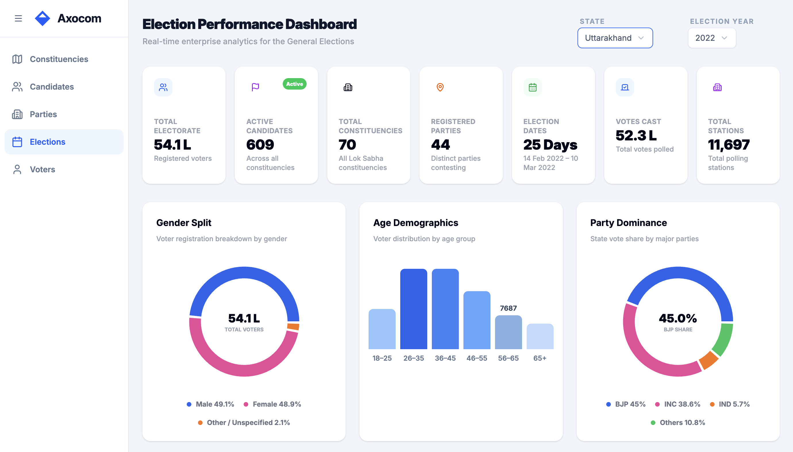
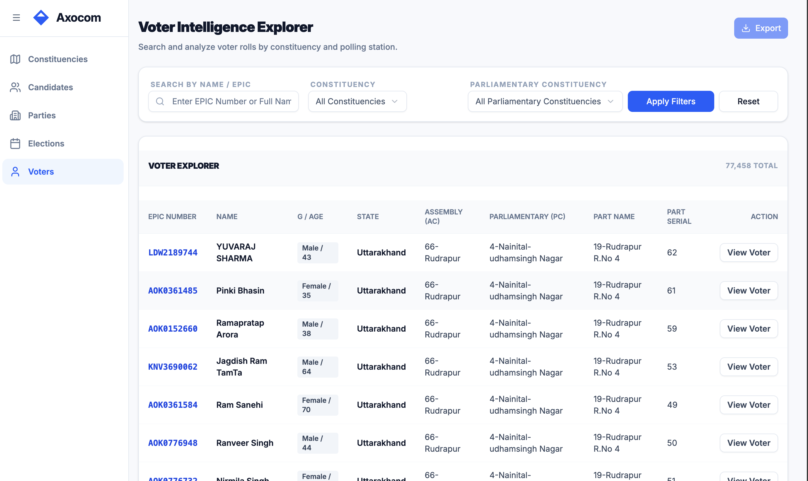
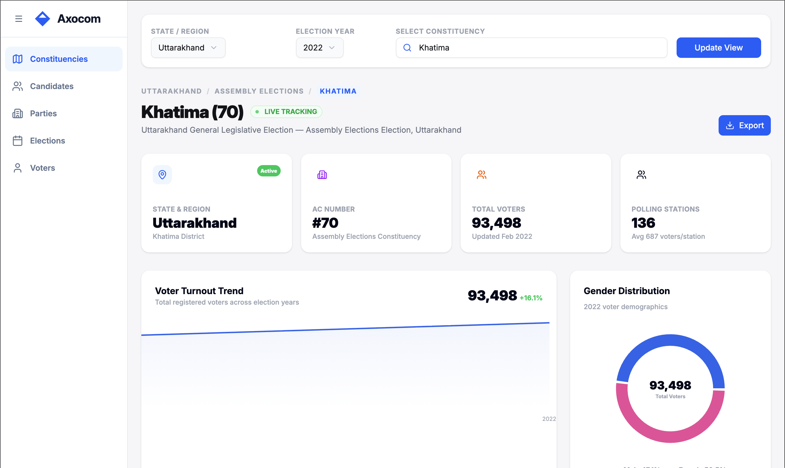

# Axocom Frontend - Electoral Data Analytics Dashboard

**Live Deployement link: https://axocom-client.vercel.app/**

A modern, full-stack React application built with React Router 7, TypeScript, and Apollo GraphQL Client for exploring and analyzing electoral data. Demonstrates advanced React patterns including server-side rendering, data fetching strategies, feature-based architecture, and enterprise-level component design.

## UI Preview

### Election Dashboard


### Voter Dashboard


### Constituency Dashboard


## System Architecture Overview

The frontend implements a comprehensive layered architecture with clear separation between presentation, business logic, and data management:

```
Browser / User Interface
        ↓
React Router (Page Routing & Layout Management)
        ↓
Feature Layer (Domain-Specific Logic)
├── Candidates Feature
├── Voters Feature
├── Elections Feature
├── Parties Feature
└── Constituencies Feature
        ↓
Apollo Client (GraphQL State Management & Caching)
        ↓
Component Layer
├── UI Components (Atoms)
├── Molecules (Composite Components)
└── Page Components (Routes)
        ↓
GraphQL API (axocom-backend)
        ↓
MySQL Database
```

## Core Technologies

- **Runtime**: Node.js 20 LTS
- **Framework**: React 19.2 with React Router 7.12
- **Language**: TypeScript 5.9 (strict mode)
- **Build Tool**: Vite 7 with React Router plugin
- **GraphQL Client**: Apollo Client 4.1 with InMemoryCache
- **Styling**: Tailwind CSS 4 with Vite integration
- **UI Components**: Radix UI primitives, Lucide React icons
- **Data Visualization**: Recharts for analytics charts
- **Testing**: Vitest for unit and integration tests
- **Code Organization**: Feature-based modular architecture

## Key Design Patterns

### 1. Feature-Based Architecture

The application is organized around domain features rather than technology layers. Each feature encapsulates all concerns for that domain:

```
app/features/
├── candidates/
│   ├── hooks/              # useCandidate*, useCandidateList, etc.
│   ├── services/           # GraphQL queries and mutations
│   ├── utils/              # Feature-specific utilities
│   └── types.ts            # TypeScript interfaces
├── elections/
│   ├── hooks/
│   ├── services/
│   ├── utils/
│   └── types.ts
├── voters/
├── parties/
└── constituency/
```

**Benefits**:

- Reduced coupling between features
- Easy to add/remove features independently
- Clear data flow within each feature
- Improves code maintainability and testability

### 2. Atomic Component Design

Components follow a hierarchical structure from simple to complex:

```
app/components/
├── ui/                     # Atoms - Base UI components
│   ├── button.tsx         # Reusable button
│   ├── input.tsx          # Form input
│   ├── card.tsx           # Card container
│   ├── table.tsx          # Data table
│   └── ...                # Other primitives
├── molecules/             # Composite components
│   ├── stat-card.tsx      # Statistics display (button + text)
│   ├── ratio-pie-chart.tsx # Chart visualization (chart + labels)
│   ├── candidate-summary-card.tsx
│   ├── constituency-filter.tsx
│   └── ...
└── complex/               # Page-level components (optional)
```

**Component Philosophy**:

- **UI Components**: Pure presentation, heavily reusable, no business logic
- **Molecules**: Combine UI components for specific patterns, minimal logic
- **Page Components**: Orchestrate features, handle routing, compose molecules

### 3. Custom Hooks for Business Logic

All feature-specific logic lives in custom hooks:

```typescript
// Feature-specific hooks encapsulate data fetching and state
export function useCandidateList() {
  const [candidates, setCandidates] = useState<Candidate[]>([]);
  const [loading, setLoading] = useState(false);
  const [searchName, setSearchName] = useState("");
  const [constituency, setConstituency] = useState("");
  const [caste, setCaste] = useState("");
  const [party, setParty] = useState("");

  // Fetch candidates on filter changes
  useEffect(() => {
    fetchCandidates({
      name: searchName,
      constituency,
      caste,
      party,
    });
  }, [searchName, constituency, caste, party]);

  return {
    candidates,
    loading,
    searchName,
    setSearchName,
    // ... other state and setters
  };
}

// Usage in component:
const { candidates, loading, searchName, setSearchName } = useCandidateList();
```

This pattern centralizes complex logic away from components, improving testability and reusability.

### 4. Apollo Client Integration

Centralized GraphQL state management with intelligent caching:

```typescript
// app/lib/api.ts
export const apolloClient = new ApolloClient({
  link: new HttpLink({
    uri: GRAPHQL_ENDPOINT,  // Points to backend GraphQL endpoint
  }),
  cache: new InMemoryCache({
    typePolicies: {
      Query: {
        fields: {
          // Customize caching behavior per field
          // e.g., pagination policies, field merging
        },
      },
    },
  }),
});

// app/root.tsx - Make ApolloClient available to all components
export default function App() {
  return (
    <ApolloProvider client={apolloClient}>
      <Outlet />  {/* React Router outlets */}
    </ApolloProvider>
  );
}
```

**Caching Strategy**:

- Automatic normalization of GraphQL responses
- Field-level cache policies for complex queries
- Request deduplication within a single operation
- Manual cache updates for optimistic UI updates

### 5. React Router Integration

File-based routing with co-located route configuration:

```typescript
// app/routes.ts - Central route configuration
export default [
  index("routes/home.tsx"),
  route("candidates", "routes/candidates.tsx"),
  route("candidates/:id", "routes/candidate-profile.tsx"),
  route("voters", "routes/voter-list.tsx"),
  route("voters/:id", "routes/voter-profile.tsx"),
  route("elections", "routes/election.tsx"),
  route("parties", "routes/parties.tsx"),
  route("parties/:id", "routes/party-profile.tsx"),
  route("constituency", "routes/constituency.tsx"),
] satisfies RouteConfig;
```

**Route Structure**:

- **Home**: Dashboard/landing page
- **Candidates**: List and filter candidates
- **Candidate Profile**: Detailed candidate information
- **Voters**: Voter registry and search
- **Voter Profile**: Individual voter details
- **Elections**: Election metadata and results
- **Parties**: Political party information and statistics
- **Parties Profile**: Party-specific details
- **Constituency**: Electoral constituency browser

## Component Architecture

### UI Components (Atoms)

Pure presentation components with no business logic:

```typescript
// app/components/ui/button.tsx
interface ButtonProps extends React.ButtonHTMLAttributes<HTMLButtonElement> {
  variant?: 'primary' | 'secondary' | 'ghost';
  size?: 'sm' | 'md' | 'lg';
  children: React.ReactNode;
}

export function Button({ variant = 'primary', size = 'md', ...props }: ButtonProps) {
  return <button className={cn(buttonStyles({ variant, size }))} {...props} />;
}

// app/components/ui/card.tsx
export function Card({ children, className }: props) {
  return <div className={cn('rounded-lg border bg-white shadow', className)}>{children}</div>;
}
```

**Available UI Components**:

- Button: Multiple variants and sizes
- Input: Form text input
- Select: Dropdown selection
- Card: Container component
- Badge: Status/label display
- Avatar: User avatars with fallback
- Table: Data table with sorting
- DataTableCell: Formatted table cells

### Molecules (Composite Components)

Combine UI components for specific domain patterns:

```typescript
// app/components/molecules/stat-card.tsx
interface StatCardProps {
  title: string;
  value: number | string;
  trend?: number;
  icon?: React.ReactNode;
}

export function StatCard({ title, value, trend, icon }: StatCardProps) {
  return (
    <Card className="p-4">
      <div className="flex items-start justify-between">
        <div>
          <p className="text-sm text-gray-500">{title}</p>
          <p className="text-2xl font-bold">{value}</p>
          {trend && <Trend value={trend} />}
        </div>
        {icon && <Icon>{icon}</Icon>}
      </div>
    </Card>
  );
}

// app/components/molecules/ratio-pie-chart.tsx
export function RatioPieChart({ data, title }: RatioPieChartProps) {
  return (
    <Card>
      <h3 className="text-lg font-semibold">{title}</h3>
      <PieChart data={data} />
    </Card>
  );
}
```

**Available Molecules**:

- StatCard: Statistics display with optional trend
- RatioPieChart: Pie chart visualization
- TrendAreaChart: Time-series area chart
- CandidateSummaryCard: Candidate preview card
- ConstituencyFilterBox: Multi-field filter component
- DataTableCard: Table with header and footer
- CandidateRow: Table row for candidate data
- Sidebar: Application navigation
- LogoWithTitle: Header branding

### Page Routes

Each route file handles feature orchestration and layout:

```typescript
// app/routes/candidates.tsx
export default function CandidateExplorer() {
  const { navItems, onNavChange } = useNavigation();
  const [sidebarOpen, setSidebarOpen] = useState(true);

  const {
    candidates,
    loading,
    searchName,
    setSearchName,
    constituency,
    setConstituency,
    caste,
    setCaste,
    party,
    setParty,
    options,
  } = useCandidateList();  // Feature hook

  return (
    <div className="min-h-screen bg-[#F7F9FC]">
      <Sidebar {...sidebarOpen} />

      <main className={cn('pl-8', sidebarOpen && 'pl-60')}>
        <div className="space-y-6">
          <h2>Find Candidates</h2>

          {/* Molecules */}
          <CandidateFilterBar
            searchName={searchName}
            onSearchNameChange={setSearchName}
            constituency={constituency}
            onConstituencyChange={setConstituency}
            constituencyOptions={options.constituencies}
            caste={caste}
            onCasteChange={setCaste}
            casteOptions={options.castes}
            party={party}
            onPartyChange={setParty}
            partyOptions={options.parties}
          />

          <CandidateDataTable candidates={candidates} loading={loading} />
        </div>
      </main>
    </div>
  );
}
```

## Data Flow

```
User Interaction
       ↓
Route Component Mounted
       ↓
Custom Hook Initialized
       ↓
GraphQL Query via Apollo Client
       ↓
Backend GraphQL Server
       ↓
Database Query
       ↓
Response Cached in Apollo Client
       ↓
Component Re-renders with Data
       ↓
UI Updated
```

## Feature Modules

### Candidates Feature

Browse, filter, and analyze electoral candidates:

**Data Operations**:

- Query all candidates with optional filters
- Get candidate by ID with full profile
- Filter by constituency, caste, party, name
- Search functionality

**Components**:

- CandidateDataTable: Filterable data table
- CandidateFilterBar: Multi-field filter
- CandidateRow: Individual row display
- CandidateProfileCard: Detailed profile view

### Voters Feature

Electoral voter registry and search:

**Data Operations**:

- Search voters by name, constituency
- Filter by demographic criteria
- View voter details and history

**Components**:

- VoterList: Paginated voter table
- VoterProfileCard: Voter information display

### Elections Feature

Election data and results tracking:

**Data Operations**:

- List all elections with metadata
- Query election results by constituency/party
- Get candidate performance in elections

**Components**:

- ElectionCard: Election summary
- ElectionResultsTable: Results visualization
- TrendAreaChart: Historical election trends

### Parties Feature

Political party information and statistics:

**Data Operations**:

- Query all parties
- Get party-specific candidates
- View party election results
- Party statistics and trends

**Components**:

- PartyCard: Party information
- PartyResultsChart: Performance visualization

### Constituencies Feature

Electoral geographic divisions and analysis:

**Data Operations**:

- Browse constituencies
- Filter by state/district
- Get constituency-specific data

**Components**:

- ConstituencyFilter: Constituency selector
- ConstituencyTitleSection: Header display

## Styling System

### Tailwind CSS Integration

Tailwind CSS 4 with Vite plugin for optimal performance:

```typescript
// vite.config.ts
export default defineConfig({
  plugins: [
    tailwindcss(), // Tailwind CSS Vite plugin
    reactRouter(), // React Router integration
    tsconfigPaths(), // TypeScript path aliases
  ],
});
```

### Design Tokens

Custom color scheme and spacing defined in Tailwind config:

```
Color Palette:
- Primary: Blue (#3B82F6)
- Secondary: Slate (#64748B)
- Success: Green (#10B981)
- Page Background: Light Blue (#F7F9FC)

Typography:
- Base Font: Inter (via Google Fonts)
- Font Weights: 100-900
- Responsive Sizing: 14-32px

Spacing:
- Scale: 4px base unit
```

### Utility Functions

```typescript
// app/lib/utils.ts
export function cn(...classes: (string | undefined | null | false)[]) {
  return classes.filter(Boolean).join(' ');
}

// Usage
<div className={cn('base-class', isActive && 'active-class')} />
```

## Build and Development

### Development Server

Hot Module Replacement (HMR) with fast refresh:

```bash
npm run dev
```

Starts development server at `http://localhost:5173` with:

- Instant file updates (HMR)
- Type checking via TypeScript
- File-based routing

### Production Build

Optimized build with code splitting:

```bash
npm run build
```

Output structure:

```
build/
├── client/              # Static assets for browser
│   ├── assets/          # CSS and JS bundles
│   └── index.html       # Entry HTML
└── server/              # Server-side code
    └── index.js         # Built server
```

Build optimizations:

- Tree-shaking dead code
- Minification and compression
- Asset hashing for caching
- Code splitting for lazy loading

### Type Checking

Generate and validate types:

```bash
npm run typecheck
```

Runs:

1. React Router type generation
2. TypeScript strict mode checking
3. Validates component prop types

### Testing

Run tests with Vitest:

```bash
npm test              # Watch mode
npm run test:run      # Single run
```

## Deployment

### Docker Deployment

Multi-stage Dockerfile for optimized production images:

```docker
# Stage 1: Development dependencies
FROM node:20-alpine AS development-dependencies-env
COPY . /app
WORKDIR /app
RUN npm ci

# Stage 2: Production dependencies only
FROM node:20-alpine AS production-dependencies-env
COPY ./package.json package-lock.json /app/
WORKDIR /app
RUN npm ci --omit=dev

# Stage 3: Build application
FROM node:20-alpine AS build-env
COPY . /app/
COPY --from=development-dependencies-env /app/node_modules /app/node_modules
WORKDIR /app
RUN npm run build

# Stage 4: Runtime image
FROM node:20-alpine
COPY ./package.json package-lock.json /app/
COPY --from=production-dependencies-env /app/node_modules /app/node_modules
COPY --from=build-env /app/build /app/build
WORKDIR /app
CMD ["npm", "run", "start"]
```

**Image Optimization**:

- Multi-stage build reduces final image size
- Only production dependencies included
- Alpine Linux minimizes base image
- ~250MB final image size

### Build and Run

```bash
# Build image
docker build -t axocom-frontend:latest .

# Run container
docker run -p 3000:3000 \
  -e VITE_GRAPHQL_ENDPOINT=http://backend:3000/graphql \
  axocom-frontend:latest
```

### Azure Container Instances

Deploy to Azure Container Registry (ACR):

```bash
# Login to ACR
az acr login --name myregistry

# Tag image
docker tag axocom-frontend:latest myregistry.azurecr.io/axocom-frontend:latest

# Push to ACR
docker push myregistry.azurecr.io/axocom-frontend:latest

# Deploy to Azure Container Instances
az container create \
  --resource-group mygroup \
  --name axocom-frontend \
  --image myregistry.azurecr.io/axocom-frontend:latest \
  --ports 3000 \
  --environment-variables \
    VITE_GRAPHQL_ENDPOINT=https://backend.azurewebsites.net/graphql
```

### Environment Configuration

```bash
# .env or runtime environment variables
VITE_API_BASE_URL=https://api.example.com
VITE_GRAPHQL_ENDPOINT=https://api.example.com/graphql
```

These variables are baked into the build at compile time (prefixed with VITE\_).

## Project Structure

```
app/
├── root.tsx                    # React root layout and Apollo setup
├── app.css                     # Global styles
│
├── routes.ts                   # Route configuration (file-based routing)
│
├── routes/                     # Page components
│   ├── home.tsx               # Home/dashboard
│   ├── candidates.tsx         # Candidate list view
│   ├── candidate-profile.tsx  # Candidate detail view
│   ├── voters.tsx             # Voter list
│   ├── voter-profile.tsx      # Voter detail
│   ├── elections.tsx          # Elections view
│   ├── parties.tsx            # Parties list
│   ├── party-profile.tsx      # Party detail
│   └── constituency.tsx       # Constituencies view
│
├── components/
│   ├── ui/                    # Atomic UI components
│   │   ├── button.tsx
│   │   ├── input.tsx
│   │   ├── select.tsx
│   │   ├── card.tsx
│   │   ├── table.tsx
│   │   ├── badge.tsx
│   │   └── ...
│   ├── molecules/             # Composite components
│   │   ├── stat-card.tsx
│   │   ├── sidebar.tsx
│   │   ├── ratio-pie-chart.tsx
│   │   ├── trend-area-chart.tsx
│   │   ├── candidates/
│   │   ├── elections/
│   │   ├── parties/
│   │   ├── voters/
│   │   └── ...
│   └── constant.ts            # Component constants
│
├── features/                  # Feature-based modules
│   ├── candidates/
│   │   ├── hooks/            # useCandidateList, useCandidate
│   │   ├── services/         # GraphQL queries
│   │   ├── utils/            # Feature utilities
│   │   └── types.ts          # TypeScript types
│   ├── elections/
│   ├── parties/
│   ├── voters/
│   └── constituency/
│
├── hooks/                     # Global custom hooks
│   ├── useNavigation.ts      # Navigation state
│   └── useCorrectionAddition.ts
│
├── lib/
│   ├── api.ts                # Apollo Client setup
│   └── utils.ts              # Utility functions
│
├── services/
│   └── flag.ts               # Flagging service
│
└── types/
    ├── constant.ts           # API endpoints
    └── nav.ts                # Navigation types
```

## Environment Variables

Configure behavior via environment variables:

```bash
# GraphQL Backend
VITE_GRAPHQL_ENDPOINT=http://localhost:3000/graphql

# REST API
VITE_API_BASE_URL=http://localhost:3000/api
```

All environment variables prefixed with `VITE_` are exposed to the client at build time.

## Performance Considerations

### Code Splitting

React Router automatically splits code at route boundaries:

- Each route is a separate bundle
- Loaded on-demand when route is accessed
- Reduces initial bundle size

### Apollo Client Caching

Intelligent caching reduces server requests:

- Automatic response normalization
- Field-level cache policies
- Request deduplication

### Image Optimization

- Lazy loading via Intersection Observer
- Responsive images with srcset
- WebP format support

### Bundle Analysis

Analyze bundle size:

```bash
npm run build -- --analyze
```

## Security Considerations

1. **GraphQL API**: All client requests pass through Apollo Client validation
2. **Environment Variables**: Sensitive values not exposed via VITE\_ prefix
3. **CORS**: Backend GraphQL endpoint configured for specific origins
4. **Content Security Policy**: Can be implemented via headers
5. **Input Validation**: GraphQL schema validation on server

## Testing Strategy

Test organization follows feature structure:

```
features/
├── candidates/
│   ├── hooks/
│   │   └── useCandidateList.test.ts
│   └── services/
│       └── queries.test.ts
```

Test patterns:

- Unit tests for utilities and hooks
- Integration tests with mock GraphQL responses
- Component tests with React Testing Library (when needed)

## Setup and Installation

### Prerequisites

- Node.js 20+
- npm or yarn
- Git

### Installation

```bash
# Clone repository
git clone https://github.com/parjanya-rajput/axocom_frontend.git
cd axocom_frontend

# Install dependencies
npm install

# Configure environment
cat > .env.local << EOF
VITE_GRAPHQL_ENDPOINT=http://localhost:3000/graphql
VITE_API_BASE_URL=http://localhost:3000/api
EOF

# Start development server
npm run dev
```

Development server runs at `http://localhost:5173`

## Available Scripts

```bash
npm run dev          # Start development server with HMR
npm run build        # Create optimized production build
npm start            # Start production server
npm run typecheck    # Validate TypeScript types
npm test             # Run Vitest in watch mode
npm test:run         # Run tests once and exit
```

## API Integration

### GraphQL Queries

Feature services define GraphQL queries:

```typescript
// app/features/candidates/services/queries.ts
import { gql } from "@apollo/client";

export const GET_CANDIDATES = gql`
  query GetCandidates($filter: CandidateFilter) {
    candidates(filter: $filter) {
      id
      name
      party
      constituency
      age
      profession
    }
  }
`;
```

### Apollo Client Integration

Execute queries through Apollo Client:

```typescript
// app/features/candidates/hooks/useCandidateList.ts
import { useQuery } from "@apollo/client";

export function useCandidateList() {
  const { data, loading, error } = useQuery(GET_CANDIDATES);

  return {
    candidates: data?.candidates || [],
    loading,
    error,
  };
}
```

## License

ISC

## Repository

[GitHub](https://github.com/parjanya-rajput/axocom_frontend)
